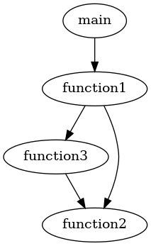

# pyfilecalltree

Generate call tree from a Python source file without profiling.

## Installation

### Prerequisites

* `graphiz`

### Pip install

```
pip install git+https://git@github.com/boupetch/pyfilecalltree.git
```

## Usage

```
import pyfilecalltree

pyfilecalltree.generate_calltree("source.py","output.png")
```

### Example

`example.py`
```
def function3():
  function2()

def function2():
  return(0)

def function1():
  function2()
  function3()

def main():
  function1()
  
main()
```

```
import pyfilecalltree
    
pyfilecalltree.generate_calltree("./example.py") 
```



